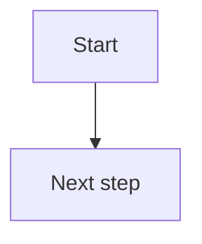

# Mermaid rules

## Output format

Return Mermaid charts like this:

## Rules

1. Nodes and edges must be clearly defined.
2. Syntax must strictly follow Mermaid requirements.
3. Do not return unescaped characters.
4. Use proper indentation and formatting.
5. Do not include comments such as `--`, `/* ... */`, or `%%`.
6. Do not use curly braces for fields or properties.
7. Do not use HTML tags.
8. Do not use parentheses or special formatting characters inside node labels. Use plain text labels for compatibility.
